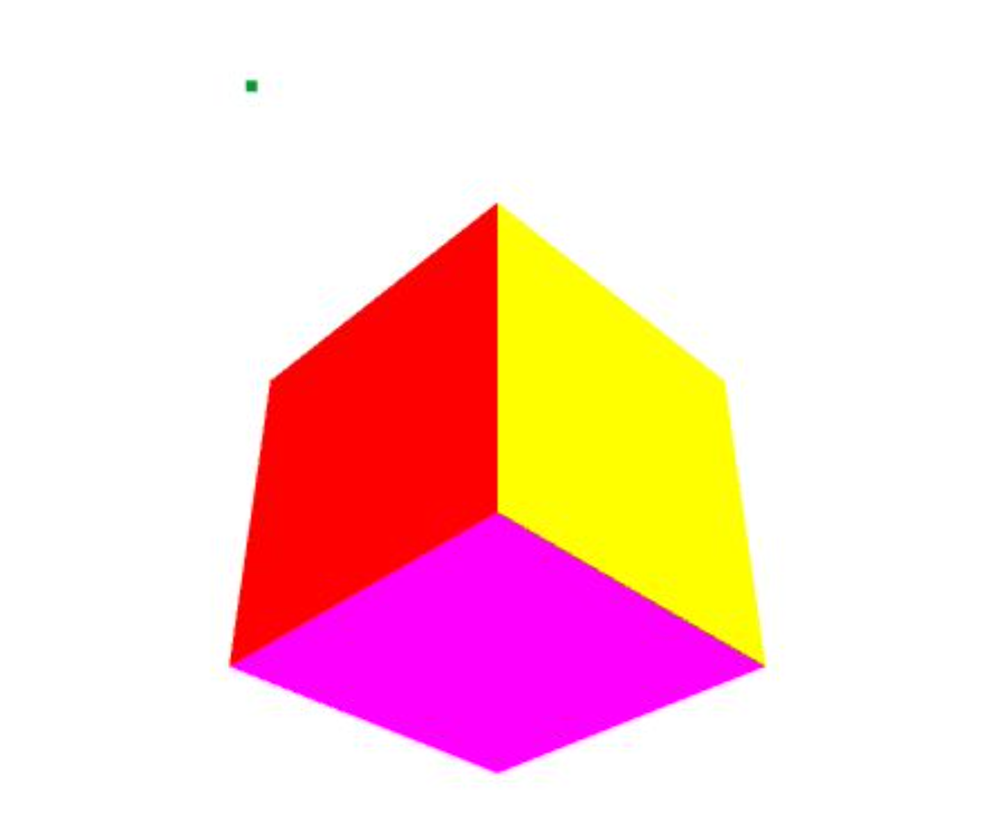
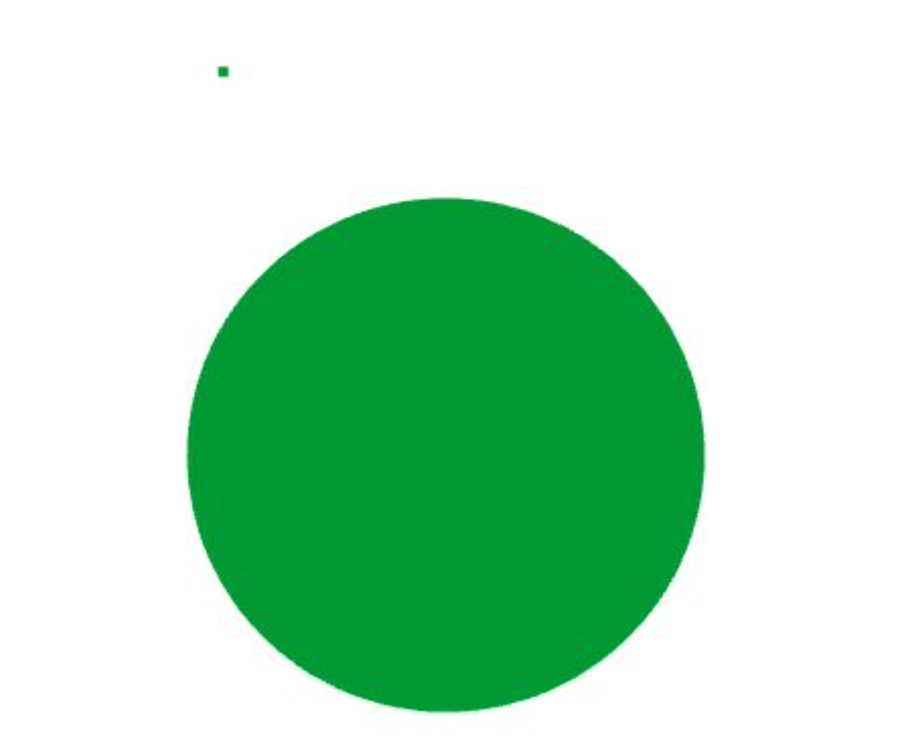
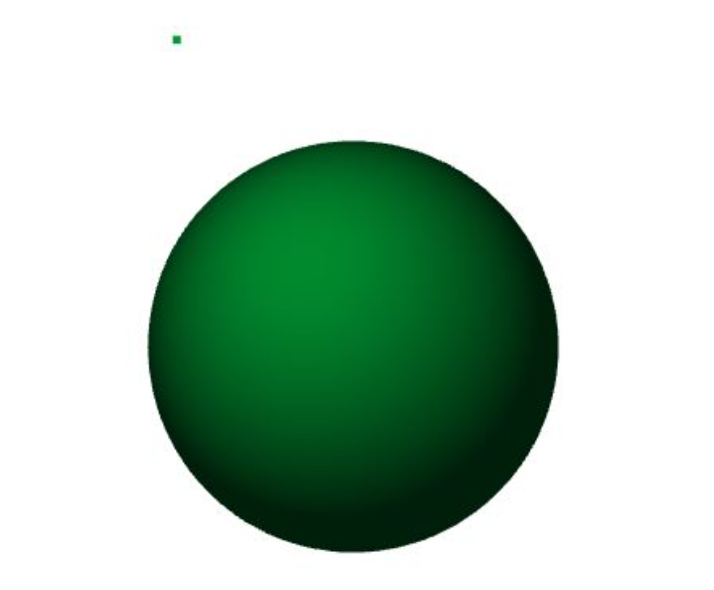
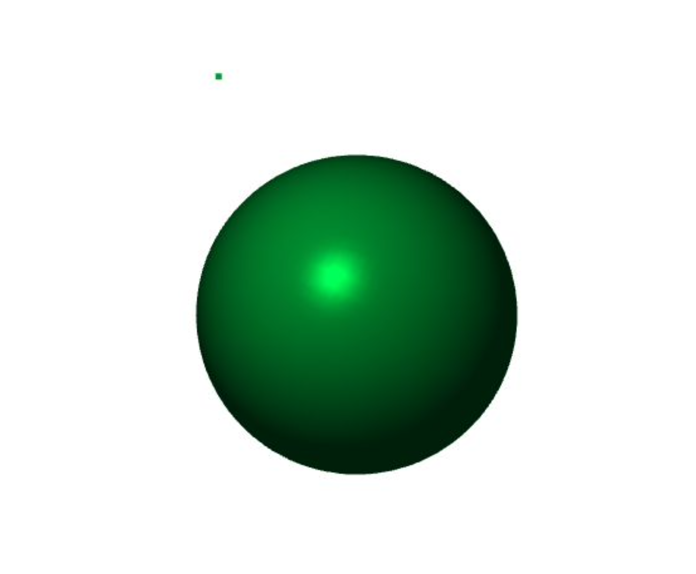
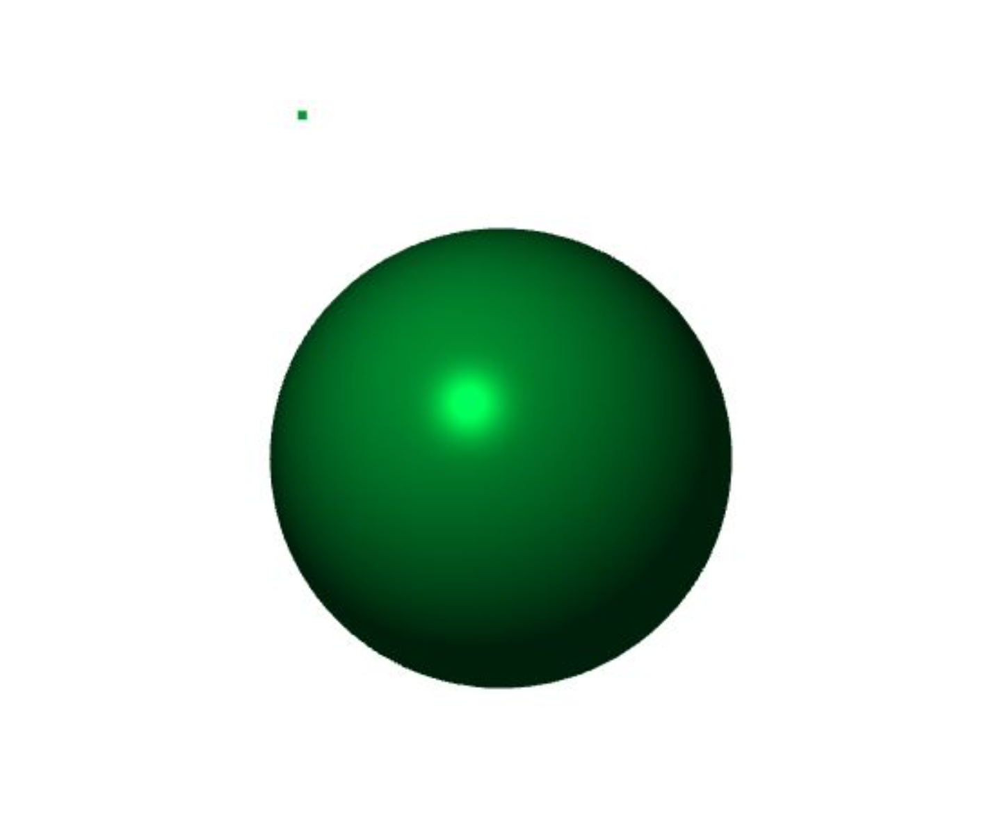

# Lighting-and-Shading
Illuminating the scene with a point light source and implementing & comparing different lighting computation methods in OpenGL.

In this project we:
* Illuminate the scene by adding a point light source.
* Insert objects (cube/sphere).
* Compute per-vertex/per-fragment normals to the objects, to be used for lighting computations.
* Implement and compare the following shading techniques:
	* Gouraud shading for diffuse lighting.
	* Phong lighting -- by computing per-vertex normals and all three lighting components: ambient, diffuse, and specular (<em>&alpha;</em> = 64).
	* Phong shading -- by computing per-fragment normals and all three lighting components: ambient, diffuse, and specular (<em>&alpha;</em> = 64).

## Results
1. Illuminate the scene by adding a point light source and objects (without shading):
		Cube             |  Sphere
	  :-------------------------:|:-------------------------:
	    |  

2. Gouraud shading (diffuse lighting):

3. Phong lighting (per-vertex):

3. Phong Shading (per-fragment):

## Execution
* Generate the object file:
	* `mkdir build && cd build`
	* `cmake ..\`
	* `make`
	* `cd ../`
* Execute the object file:
	* `./bin/lighting_and_shading`
